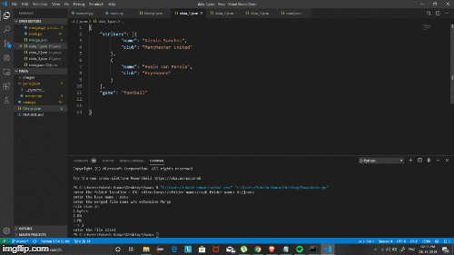

# Json Merger
A python script that lets you to merge jsons into a single json
# How to use?
* ### Step 1: Running the script
```
$ cd <navigate to script path>
$python main.py
```
* ### Step 2: Enter folder path
```

$ c:\<some path file>\ >Enter the folder path :<file_directory>:\<folder>\<sub folder>
```
* ### Step 3: Enter base name of the file
```
$ c:\<some path file>\ > Enter the base file name : <some name>
```

* ### Step 4: Enter merged json file name without extension
```
$ c:\<some path file>\ > Enter the merger file name : <some name>
```

* ### Step 5: Enter File size limit 
```
$ c:\<some path file>\ > Enter the file size in 1.bytes 2.Kb 3.Mb : <choose option>
$ c:\<some path file>\ > Enter the limit : <any_limit>

```
* ### Step 6: BOOM! watch your merged json file 
```
$ c:\<some path file>\ > The merged file size exceeds the limit . Do you still wanna keep?(y/n)
$ c:\<some path file>\ > <type 'n' to remove file>

```

# How it Works?
```python
from jsons2json.merger import json_merger
``` 
This snippet is crucial for merging json.It is a user defined module that takes
* file path
* Base name 

as arguments and merges all the jsons starting with the base name specified by the user

Also,You can specify the
* output file name 
* output file size
# Complexity Analysis
The complexity depends on 2 key factors
* Distinct keys in the json object
* Number of json files
* Length of the json array of each value of a key-value pair
``` 
Let the number of Files be -> 'N'
and Let the length of the json array be 'M'
if Each json file share a same common key 
then, complexity becomes
 ==> O(NM) <==
```
# Worst Case
Square Complexity 
```python 
O(N^2) 
```
# Sample Working
 
